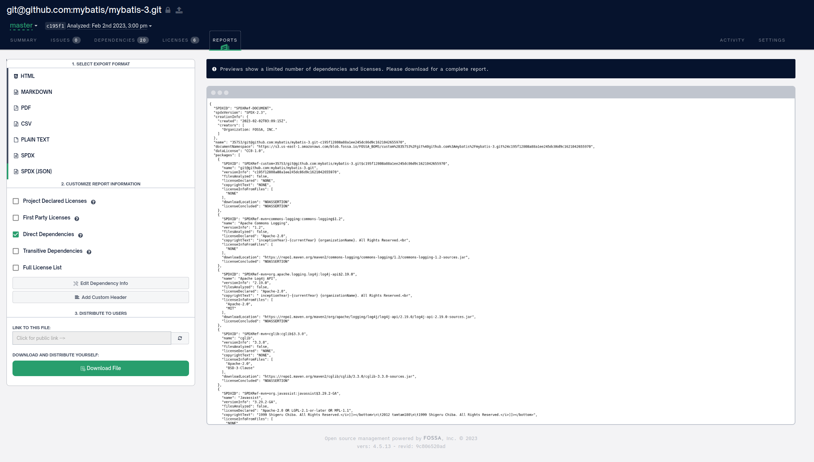

# SBOMs

Long term storage of build provenance files / software bills of material (SBOM)

## How are SBOM generated?

### SLSA

SLSA is not a tool for generating an SBOM, but rather a set of requirements for the SBOM.
Currently, the SBOM is generated by [this action](https://github.com/slsa-framework/github-actions-demo), which produces SBOM formatted as an [In-toto attestation](https://github.com/in-toto/attestation), which is the currently recommended format for an SBOM by SLSA.

There is a workflow called [sbom.yml](https://github.com/INRIA/spoon/blob/master/.github/workflows/sbom.yml) in Spoon that automatically
generates the provenance files for Spoon project for every commit to `INRIA/spoon:master`.

### Sonatype-Lift

1. Go to [sonatype lift console](https://lift.sonatype.com/results/github.com/SpoonLabs/sorald/01GF3EZ99T224KCGHP20Y32671?tab=dependencies)
   and click the "dependenices" tab.
2. Click "Export CycloneDX" button to export the SBOM in JSON format.

### Renovate

1. Inspired from Renovate's ["Detected dependecies"](https://github.com/SpoonLabs/sorald/issues/623).
2. Run the following command and you will get the list of
   "Detected dependencies" in STDOUT and the log file.
   ```bash
   renovate --token [REDACTED] --dry-run="extract"  --autodiscover --autodiscover-filter "<org_name>/<repo_name>" --log-file="renovate.log"
   ```
   One may use Renovate's npm package or docker image to the run the
   above command.
3. See https://github.com/renovatebot/renovate/discussions/18258#discussion-4463299 for more information.

### cdxgen

1. Install cdxgen npm package.
   ```
   sudo npm install -g @appthreat/cdxgen
   ```
2. Run.
   ```
   cdxgen -t java -o bom.cdxgen.json
   ```

> It seems that is uses CycloneDX maven plugin under the hood.

Link to GitHub repository: https://github.com/AppThreat/cdxgen

### CycloneDX maven plugin

1. Execute the maven-plugin at the root of the maven project.
```sh
$ mvn org.cyclonedx:cyclonedx-maven-plugin:2.7.3:makeAggregateBom
```
2. The SBOM (`bom.json` and `bom.xml`) is written inside the target folder.

Link to GitHub repository: https://github.com/CycloneDX/cyclonedx-maven-plugin

### jbom

1. Ran Spoon as CLI command and ensured that it would take long to end.
2. Quickly ran jbom on another terminal lise so:
```sh
$ java -jar jbom-1.2.jar -p <process id>
```

Link to GitHub repository: https://github.com/eclipse/jbom/

### Highlight Automated Code Scan

1. Download the tar ball from the link below.
2. Run the following command from the HLCS directory.
```sh
java -jar HighlightAutomation.jar --workingDir  ~/chains/sbom-files/sorald/ --sourceDir ~/spoonlabs/sorald --skipUpload --technologies "Java"
```

Link to tool: https://doc.casthighlight.com/product-tutorials-third-party-tools/automated-code-scan-command-line/

The tools generates a lot of CSV files that can be uploaded to 
[Highlight Platform](https://learn.castsoftware.com/trial-hl-request?utm_page=https://learn.castsoftware.com/highlight)
(proprietary) to view the results.

### FOSSA

1. Click 'Start for Free' and then follow the steps.
2. The report can be exported in SPDX format. However, only direct
dependecies are included in the report in the free version.



Link to tool: https://fossa.com/

### Meterian

1. Download the jar from the link in this [page](https://docs.meterian.io/the-client/client) - https://www.meterian.com/downloads/meterian-cli.jar.
2. Run the following command in the root of your project.
```sh
$ java -jar /tmp/meterian-cli.jar
```
3. It will ask one to authenticate because the final report it generated has limited access.

Link to tool: https://meterian.io/product/open-source-licence-compliance/

### SCANOSS

1. Install the tool.
```sh
$ pip3 install scanoss
```
2. Run the tool.
```sh
$ scanoss-py scan <path-to-project-dir>
```

Link to tool: https://github.com/scanoss/scanoss.py

### Scribe

Might be possible to run according to the instructions [here](https://scribe-security.netlify.app/docs/ci-integrations/github).

Link to tool: https://scribesecurity.com/scribe-platform-lp/ 
